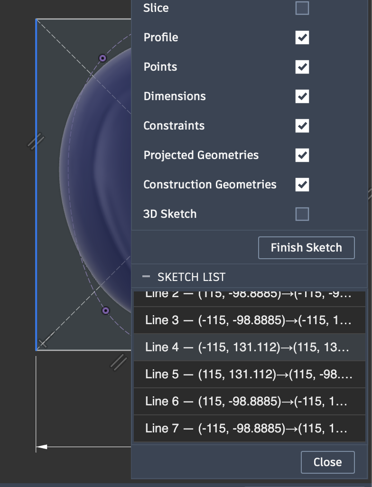

# SketchList

A small **Autodesk Fusion (360)** add-in. While you're editing a sketch, it
shows a compact panel listing **every entity in the sketch** — points, lines,
arcs, circles, ellipses, splines, conics — each labelled with its type, an index,
and its coordinates. **Click a row to select that geometry in the viewport.**

The panel appears automatically when you enter a sketch (tucked under the Sketch
Palette) and hides when you leave it. It refreshes itself as you draw or delete,
so the list always matches what's on screen.

> Why: in a busy sketch it's fiddly to pick one specific point or line. SketchList
> gives you a plain roster of everything and a one-click way to grab it.

<p align="center">
  
</p>

---

## What's in here

| File / folder | Purpose |
| --- | --- |
| `SketchList.py` | The add-in. Lifecycle, the toolbar button, the panel, and the auto show/refresh on sketch enter/exit. |
| `sketch_rows.py` | Pure "sketch → labelled rows" logic, with no Fusion imports so it's unit-testable. |
| `test_sketch_rows.py` | Self-check for the labelling/id-map. Runs with plain `python3`, no Fusion needed. |
| `palette.html` | The list UI, with light/dark theming and click-to-select. |
| `SketchList.manifest` | Metadata Fusion reads: id, version, author, supported OS. |
| `resources/command/` | `16x16.png` + `32x32.png` toolbar-button icons. |
| `thomasa88lib/` | MIT helper library (error catching, event management, manifest reader). |
| `FusionAPI.chm` | Offline Autodesk Fusion API reference (local dev aid; not part of a release). |

---

## Installing

Put the `SketchList` folder in Fusion's `API/AddIns` directory:

- **macOS:** `~/Library/Application Support/Autodesk/Autodesk Fusion 360/API/AddIns`
- **Windows:** `%appdata%\Autodesk\Autodesk Fusion 360\API\AddIns`

The folder name must be exactly `SketchList` (no `-main`/`-master` suffix) so it
matches `SketchList.py` / `SketchList.manifest`.

Then in Fusion: **Utilities → ADD-INS → Scripts and Add-Ins** (or **Shift+S**) →
*Add-Ins* tab → select **SketchList** → **Run**. Tick *Run on Startup* to load it
every session.

[Autodesk: How to install an add-in or script](https://www.autodesk.com/support/technical/article/caas/sfdcarticles/sfdcarticles/How-to-install-an-ADD-IN-and-Script-in-Fusion-360.html)

---

## Using it

1. Open a design and start or edit a **sketch**. The **Sketch List** panel
   appears as a compact floating box tucked under the Sketch Palette, filled with
   every entity in the sketch.
2. **Click a row** → that point/line/curve is selected in the viewport.
3. **Draw or delete** geometry → the list updates as soon as the command finishes.
4. **Finish Sketch** → the panel hides. Re-enter a sketch → it comes back.
5. The **Toggle Sketch List** button in *Utilities → ADD-INS* shows/hides the
   panel manually any time.

Row labels look like:

```
Point 1 — (0, 0)
Point 2 — (5, 2)
Line 1 — (0, 0)→(5, 2)
Arc 1 — c(8, 0) r=3
```

Coordinates are shown in the document's units.

**On positioning:** Fusion's API can't dock a palette to a specific spot, so the
box opens as a floating panel auto-placed under the Sketch Palette. If you'd
rather it stay put, drag it against a window edge — Fusion remembers edge docks
across sessions, and SketchList won't override a placement you've made yourself.

---

## Developing

Edit the code, then **Stop** and **Run** again from the Shift+S dialog to reload.
The `importlib.reload(...)` lines at the top of `SketchList.py` make Fusion pick
up your latest changes on each Run.

Run the self-check (no Fusion required):

```bash
python3 test_sketch_rows.py     # prints "ok"
```

`print(...)` output lands in Fusion's **Text Commands** console
(*View → Show Text Commands*). Uncaught errors surface as a copyable traceback via
`thomasa88lib`'s error catcher.

`FusionAPI.chm` is the full offline API reference. On macOS `.chm` isn't native;
read the same content online at the
[Fusion API & Scripts docs](https://help.autodesk.com/view/fusion360/ENU/?guid=GUID-7B5A90C8-E94C-48DA-B16B-430729B734DC).

---

## Releasing

A release zip must unpack to a single directory named exactly `SketchList` and
exclude `__pycache__`, `settings.json`, `.DS_Store`, `.git`, and the bundled
`FusionAPI.chm` (large, and Autodesk's to distribute — kept local, git-ignored).
To rebuild it from the repo root:

```bash
git archive --format=zip --prefix=SketchList/ -o SketchList-$(git describe --tags).zip HEAD
```

`git archive` honours `.gitignore`, so the excludes above are automatic. Attach
the resulting zip to the matching GitHub release tag.

---

## Credits & license

- Built on **FusionAddinTemplate**, which follows Thomas Axelsson's
  [VerticalTimeline](https://github.com/thomasa88/VerticalTimeline) and reuses his
  MIT-licensed [`thomasa88lib`](https://github.com/thomasa88/thomasa88lib) — see
  `thomasa88lib/LICENSE`.
- `FusionAPI.chm` is © Autodesk, included as a development reference only.
- SketchList is MIT licensed — see `LICENSE-MIT`.
